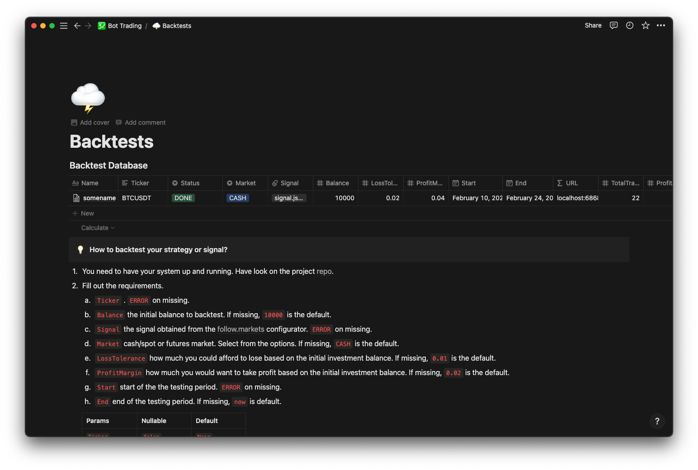
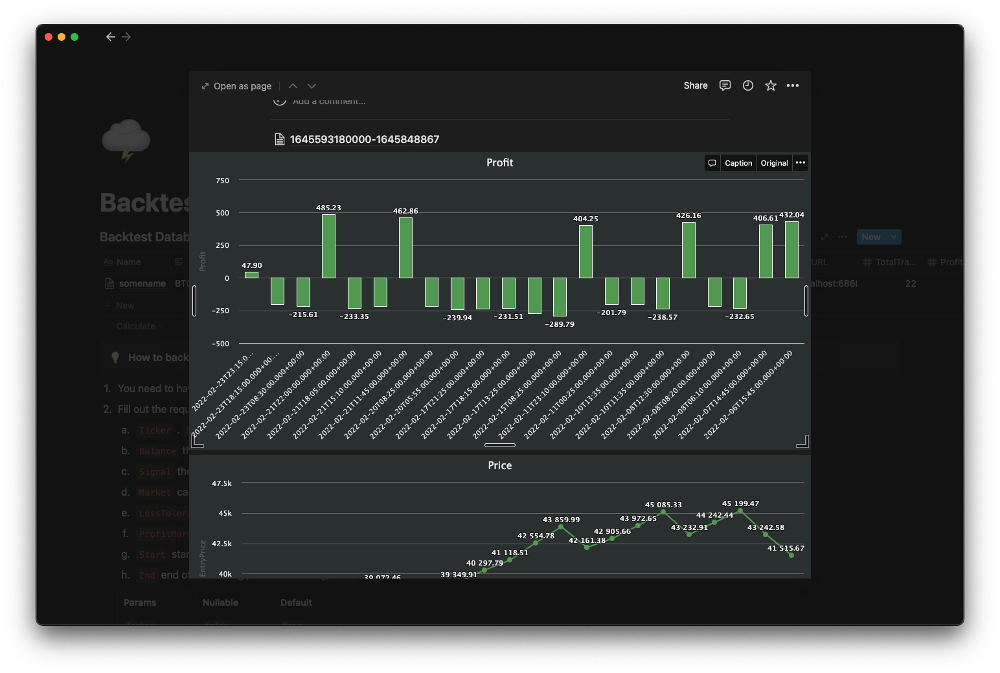
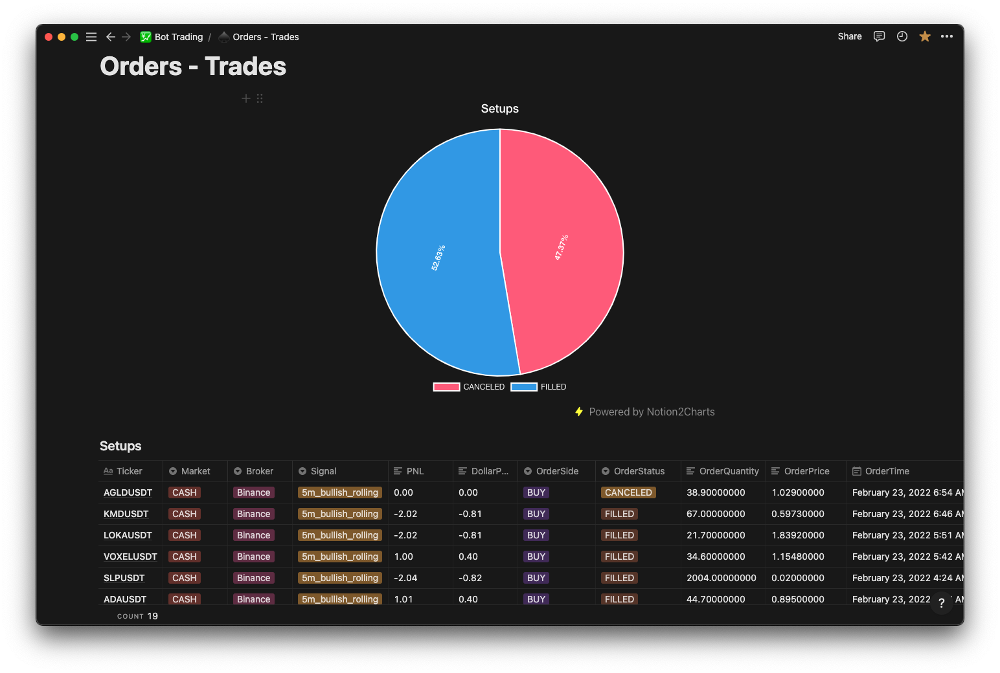
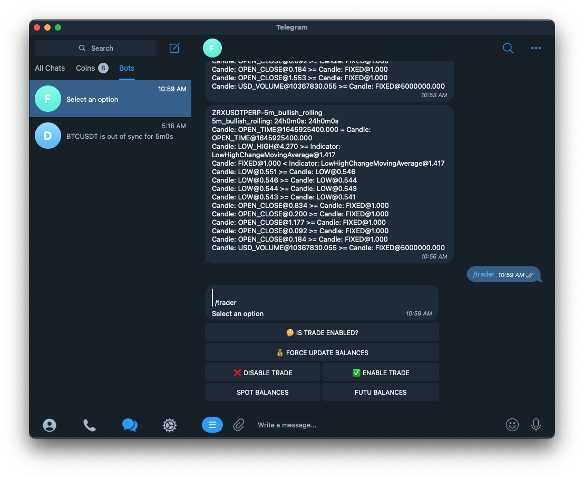
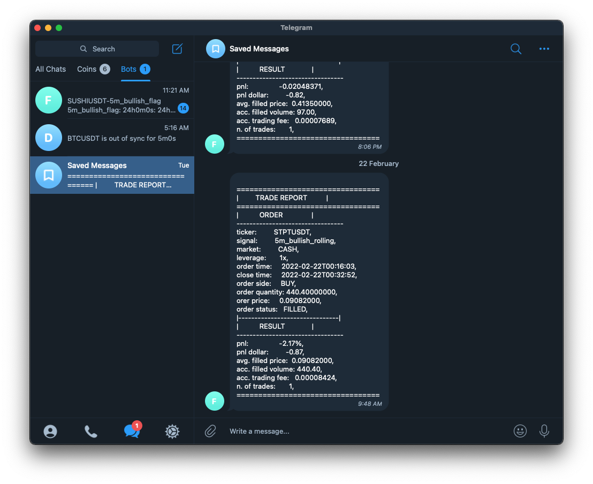

# About
This is an engine that enables traders to configure trading signals from markets' observable price actions, backtest trading signals/strategies, and eventually conduct/manage trades.

This project was born because I found it hard to
1. constantly keep track of the entire market movements based on a set of configurable conditions/rules which is called `signal`.
2. quickly validate trading strategies with absolutely zero coding steps. When a beautiful strategy pops up in my head, just configure it, then execute a backtest request.
3. trade the markets with configurable, validated & profitable strategies.

So if you find yourself suffering the same pains I had, give it a shot. I would love to hear your thoughts about this.

# Getting Started

The easiest way is to pull the docker image `phat/follow.markets:main` from the docker hub, clone this project and update the `configs/configs.json` file with your personal credentials and likings then run the docker command 

```
git clone https://github.com/heyphat/follow.markets.git

cd follow.markets

docker pull phat/follow.markets:latest

docker run -d --rm --name follow.markets \
  -p 6868:6868\
  -v $(pwd)/configs/configs.json:/configs/configs.json \
  -v $(pwd)/configs/results:/configs/results \
  -v $(pwd)/configs/signals:/configs/signals \
  phat/follow.markets:latest
```

change the port flag, `-p`, to match with your setting of `server.port` in the `configs/configs.json` file if needed.

If you use arm64-based machine or want to build it from the source code, run the `bash scripts/build` to build docker image, it should build the image with `dev` tag.

After the application deployment, you should be able to call to check on the watchlist via the watcher [APIs](https://github.com/heyphat/follow.markets/blob/main/docs/watcher.mdx). If you check the logs you should see this

```
2022/02/26 11:53:02 Datadog Tracer v1.34.0 INFO: DATADOG TRACER CONFIGURATION .......
172.17.0.1 - - [26/Feb/2022:11:53:04 +0000] "POST /evaluator/drop/sample HTTP/1.1" 200 0
INFO: 2022/02/26 11:53:06 watcher.go:147: [watcher] ETHUSDT: started watching
INFO: 2022/02/26 11:53:08 watcher.go:147: [watcher] ETHUSDTPERP: started watching
INFO: 2022/02/26 11:53:11 watcher.go:147: [watcher] BTCUSDT: started watching
INFO: 2022/02/26 11:53:14 watcher.go:147: [watcher] BTCUSDTPERP: started watching
```

# Configuration

This part discusses only the mandatory variables in the `configs/configs.json` file. For more information, refer to the docs [here](https://github.com/heyphat/follow.markets/tree/main/configs).

1. Market data provider: `market.provider.binance`. The application targets crypto market at the moment and consumes data provided by Binance. You need to have a Binance account and get the keys, `api_key` and `secret_key`. 
2. Market notifier bot: 
    1. `market.notifier.telegram.bot_token`. Ask the [BotFather](https://core.telegram.org/bots) for a telegram `bot_token` if you don't know how to get it yet. Then start a conversation with your bot after deploying the system. If you know your tele account `chatID`, you can add it to the `market.notifier.telegram.chat_ids` in advance. Otherwise, you can obtain it from the `bot`.
    2. `market.notifier.telegram.bot_password` this password is to prevent others to access your bot. You can set it to anything, the bot will ask you for authorization when you start talking to it.
3. Visit the signal configurator [here](https://follow.markets) to craft your own signals, or download some samples
    1. 5 minute bullish flag, [here](https://follow.markets/signals/5m_bullish_flag).
    2. 15 minute bullish flag, [here](https://follow.markets/signals/15m_bullish_flag).
    3. 5 minute bullish rolling, [here](https://follow.markets/signals/5m_bullish_rolling)
    4. 15 minute moving average crossing over, [here](https://follow.markets/signals/15m_ma_cross_over)
4. Market signal source path: `market.evaluator.source_path`. Place your signals into this directory before deployment. There is another way to add signals to the system, visit the [evaluator docs]() for more information.

# Todos 
- [ ] Add more indicators.
- [ ] Add more brokers.
- [ ] Integrate with the stock market.

# More docs (to be updated...)
1. [Configuration](https://github.com/heyphat/follow.markets/tree/main/configs)
2. The market components & APIs 
    1. [Watcher](https://github.com/heyphat/follow.markets/blob/main/docs/watcher.mdx)
    2. [Evaluator]()
    4. [Notifier]()
    5. [Tester]()
    6. [Trader]()
    7. [Streamer]()
3. Other concepts 
    1. [Signal]()
    2. [Strategy]()
    3. [Runner]()
    4. [Indicator]()
    5. [Database]()


# Examples
1. Visit the configurator to see it for yourself.
2. Some backtest samples. I'm using Notion option from the `database` configs. Here is the [link](https://paxon.notion.site/Dev-Trading-5b9bc26a7a2c4bdbb6f671a59fc8a326) to the notionDB template that you need to duplicate if you want to use notion.
    1. 
    2. 
3. Some real trades completed by the bot with one of the sample signals
    1. 
4. Telebot communications
    1. 
    2.  

# Contribution
Feel free to send PRs.

# Disclaimer
This software is for educational purposes only. Do not risk money which you are afraid to lose. USE THE SOFTWARE AT YOUR OWN RISK. THE AUTHORS AND ALL AFFILIATES ASSUME NO RESPONSIBILITY FOR YOUR TRADING RESULTS.

# Support
<p align="center">
    <a href="https://www.buymeacoffee.com/phat" target="_blank"></a>
</p>

